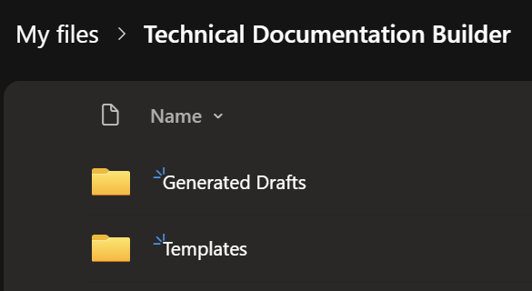
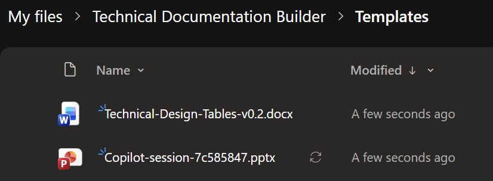

# Reusing the public templates

The three starter templates are authored inputs, not completed agent outputs.
A separate unchanged native Standard solution export is now included without
live connections. A controlled second Developer-environment import succeeded with
warnings; target configuration is pending and runtime remains unverified.
Start with your own authorised Copilot Studio environment.

## Native Standard solution

[Download the native unmanaged export](TechnicalDocumentationBuilderDeployed_unmanaged_20260928T105706Z.zip):
`TechnicalDocumentationBuilderDeployed` v1.0.0.0, 185,544 bytes, SHA-256
`1ed91d72266aab9fecf5639b8a1adc47e1d153574f99574779301b44e3c0442b`.
Verify the downloaded bytes before importing. This is a native export-only
wrapper around unchanged deployed code, not a portable-renderer redesign.

It contains 2 agents (Technical Documentation Builder and Docs Compare - Standard),
39 agent components, 5 flows, 3 models with 6 configurations, 3 connection
references, 9 flow associations and 1 direct Word connector association.
The flow set is Word draft, core Word v0.2 render, legacy Word v0.1 render,
Long draft and Long render. No Short/image extension flows, Office template
binaries, saved test/user inputs or environment-variable installer are bundled.

**Imported with warnings; target configuration pending; runtime not verified.**
A controlled second import attempt in a separate Developer environment succeeded
on 28 September 2026 at 12:38 UTC, using a fresh download of the same byte-identical
public ZIP. Staging passed with no missing dependencies. Native membership and
schema checks verified the unmanaged v1.0.0.0 solution and expected inventory,
with 62 solution-membership entries. Agent IDs were regenerated on import, so
verification used solution membership and schemas rather than old source IDs.
All five flows were Off at verification; all three saved prompt payloads matched
the source/public export.

The successful import log recorded 18 success, 5 warning and 0 failure results.
These are log results, not component counts. Warnings concern source Predict
organization bindings and missing target Word Online (Business) / OneDrive for
Business connections. Target configuration is ongoing; import does not establish
prompt readiness, agent publishing or working runtime.

**First attempt / historical failure:** Staging passed with no missing dependencies
or validation errors, but import failed in the Microsoft agent-to-flow association
service with `BadGatewayConnection`. Checks after that attempt found no installed
solution or matching agent, flow, AI model or connection-reference records.
Intermediate import-log successes did not prove installed components. These checks
covered those record types, not all external resources. Two controlled import
attempts in total, not blind retries; the first failure is not the current import status.
The reusable setup checklist below is separate from these recorded import outcomes.

### Native import boundary

Use an authorised Developer environment after inspecting existing components.
Three native missing-dependency records refer to the AI Model table from
`msdyn_AISolution (202608.4.19.2)`; check target platform compatibility and retain
any native import warnings/errors. Do not suppress missing dependencies.
The first failed attempt used `PublishWorkflows=false` and
`OverwriteUnmanagedCustomizations=false`. These flags are not a guarantee that
existing flows are disabled or existing unmanaged components cannot change.
Prefer a clean target; importing an unmanaged
solution can update existing components, and deleting its container does not
remove them. See [Microsoft's native import guidance](https://learn.microsoft.com/power-apps/maker/data-platform/import-update-export-solutions).

## Cross-tenant deployment setup

**Required for every adopter, not just the environment in our evidence.**
Use these five setup steps for the imported native solution. They are configuration
instructions, not runtime tests or a request to complete our separate proof work.
The ZIP does not provision authenticated connections, template files or output
storage, and import is not agent publication or distribution.

### Prerequisite: your own OneDrive for Business

**Adopters must set up their own OneDrive arrangement.** For this solution that
means **OneDrive for Business storage plus authenticated connector connections**,
not a separate model-driven app or a custom app registration. The intended
destination identity needs the appropriate OneDrive entitlement, a provisioned
business OneDrive, and tenant policy/access that permits the intended use.

Open **OneDrive** from Microsoft 365's app launcher while signed in as that
destination identity. If its business OneDrive is missing or inaccessible, ask
the destination tenant administrator to resolve entitlement, provisioning or
access before proceeding. A personal/consumer OneDrive or another identity's
drive is not a substitute for the intended business connection.

**Import does not provision OneDrive, create folders, copy templates or transfer
connections.** Manually create the folders and upload the approved exact files
in step 2. Ensure the chosen identity has read access to templates and write
access to the output folder. Create the Word and OneDrive connections under that
same destination identity, bind their solution references, and reselect the
destination file IDs/version pins; folder names alone are not configuration.

### 1. Choose destination and bind connections

Select the intended destination tenant and environment in the maker portal and
Copilot Studio before changing anything. Confirm that the authorised destination
identity can use that environment and access the intended storage. Do not reuse a
connection merely because it belongs to the account currently signed in.
Use the **same authorised destination identity for Word Online (Business) and
OneDrive for Business**, so Word's `source='me'` selection and the OneDrive
file actions refer to that identity's destination storage.

Open **Connections** in the Power Apps / Power Automate maker navigation
(under **More**, or **Data > Connections**, depending on the navigation shown).
Create or reuse **Connected** connections for all three connectors below. Use
**New connection**, select the connector, and complete the destination sign-in
and consent when requested. The deployer may need to participate; import does
not transfer consent or authenticated sessions from another tenant.

In **Solutions > TechnicalDocumentationBuilderDeployed > Objects > Connection
references**, open each imported reference, select its intended destination
connection, and save. Wait for the connection-reference update to complete.
Use the reference's logical name to distinguish it from similarly named entries:

| Native reference | Target connector |
| --- | --- |
| `tdb_DraftingPrompt` | Microsoft Dataverse |
| `tdb_WordRenderer` | Word Online (Business) |
| `tdb_OneDriveDrafts` | OneDrive for Business |

**Import copies connection references, not live authenticated connections.**
Every adopter must bind all three; the recorded Dataverse binding in our separate
target is not a default for anyone else. The person enabling a flow must own or
have authorised use of all its required connections.

Also open the retained **direct Word action** in the imported agent's tool/action
configuration. Verify its destination Word connection, authentication mode and
intended user's access. A solution flow's connection-reference binding does
**not** automatically configure that direct action or the agent's end-user
authentication. Follow supported prompts for consent and permissions; do not
bypass tenant policy.

Microsoft references: [manage connections](https://learn.microsoft.com/power-automate/add-manage-connections)
and [solution connection references](https://learn.microsoft.com/power-apps/maker/data-platform/create-connection-reference).

### 2. Provision templates and output storage

Templates and storage are **external to the solution ZIP**. Sign in to the
**destination connector identity's OneDrive for Business**, open **My files**,
and use **New / Add new > Folder** to create **Technical Documentation Builder**.
Open it and manually create the **Templates** and **Generated Drafts** sibling
folders:

```text
Technical Documentation Builder
  Templates
    Technical-Design-Tables-v0.2.docx
    Copilot-session-7c585847.pptx  (approved exact original Long template only)
  Generated Drafts
```

Upload the separately downloadable Word v0.2 template to **Templates**. If you
have authorised access to the exact approved original Long template, upload its
unchanged bytes there as **Copilot-session-7c585847.pptx**. The optional legacy
Word route needs its separate v0.1 template; the table below distinguishes it.
Upload the files **without resaving them**; confirm the destination copies retain
the exact required bytes and bind the actual destination file/version.
**Solution import does not create these folders or copy/upload the templates.**
Do this in the destination identity's OneDrive, not the source account's drive
or an unrelated account with a similar display name.

**Actual setup illustrations / 28 September 2026.** The deployer supplied these
genuine OneDrive screenshots. Local rectangular crops exclude account chrome
and identifying **Modified By** columns; no UI was recreated and no pixels
inside the crops were edited. Raw screenshots remain private. Open each image
for its full-size view.

[](../assets/deployment-onedrive-folders.png)

*Folder view: create Templates and Generated Drafts under Technical Documentation
Builder in the destination identity's business OneDrive.*

[](../assets/deployment-onedrive-template-files.png)

*Template-file view: the two filenames are visible. The original Long file is
not made downloadable by this screenshot.*

**These images show folder arrangement and visible filenames only.** They do
not establish authenticated connections, exact file bytes/hashes, resource
bindings, agent publication or runtime. In particular, the visible PPTX filename
does not establish that a file satisfies the registered byte-integrity/contract checks.

The unchanged Long content action uses
`/Technical Documentation Builder/Templates/Copilot-session-7c585847.pptx`.
All three renderer output actions use
`/Technical Documentation Builder/Generated Drafts`. These are paths within
the connected OneDrive for Business, not a local computer folder.
Give the chosen identity the required read/write access; set ownership and
retention intentionally. Generated files do not need public access.

**Matching folder names alone is insufficient.** In step 3, reselect Word's
destination drive/file, both Long metadata file IDs, destination ETags/file-version
pins and returned links while preserving all exact-byte integrity/contract guards.
**SharePoint is not a drop-in destination for this OneDrive-wired solution.**
Moving to a SharePoint library requires actual flow changes; uploading the files
there does not make these actions discover them.

| Route | Actual dependency |
| --- | --- |
| Core prepared Word v0.2 | The separately downloadable [14,564-byte Word template](Technical-Design-Tables-v0.2.docx), SHA-256 `00486f3d164344c68f6b5a3f100c18c77e9c7c80f701cfa7e0d54ca3078c339c`. Store it in authorised target storage and configure its target IDs/ETag and mappings. |
| Optional legacy/direct Word v0.1 | A different 12,629-byte template, not bundled. Do not substitute v0.2 or treat this retained route as new runtime proof. |
| Long PowerPoint | The exact original 11-slide, 98,985-byte template, SHA-256 `7c5858479154c2c5d20a2e8c636faddd252c90fbcd97acd209fa13880e21916b`, satisfying all registered integrity/contract checks. The original remains withheld and is not downloadable here. |

**A separately downloadable public-release copy is not compatible.** Both Long
contracts and the unchanged code interpreter require the exact original bytes
and registered integrity checks. No drop-in replacement, new renderer or guard removal is
included. **Without the exact approved original Long template, leave the Long
route disabled**; a public-release copy is insufficient for this unchanged native
route. Do not remove the integrity/contract guards or change template bytes, prompt code
or the platform signature to make another file pass. Public availability of
the native ZIP is not clearance to redistribute the original template.

The available Short5/Short5withImages starter templates and cats-and-dogs output
downloads are not replacements for the original Long runtime template. The
optional legacy Word v0.1 route likewise cannot use v0.2 as a drop-in substitute.

### 3. Retarget imported flow settings and save

This archive has **zero environment variables**. It has no 12-environment-variable
installer: the settings are actual action inputs, resource selections and guard
expressions in the imported flows.

In the destination maker portal, open **Solutions >
TechnicalDocumentationBuilderDeployed > Objects > Cloud flows**, select the
intended flow and **Edit**. Use the supported Power Automate designer and **Save**
path for the imported flow. Keep flows Off while configuring them. Expand their
scopes and conditions to reach the following native action names; these names
come from the unchanged public archive, not redesigned example flows.

| Imported flow / role | Destination settings to configure |
| --- | --- |
| Word drafting (`TechnicalDocumentationBuilder-DraftStructuredConte...`) | In `Run_dedicated_prompt`, set the Predict `organization` field to the destination Dataverse organisation URL. Confirm the action resolves the imported drafting prompt/configuration through `tdb_DraftingPrompt`. |
| Core Word tables v0.2 (`TechnicalDocumentationBuilder-RenderWordTablesv02`) | Point `Check_template_metadata` at the destination v0.2 file in Templates. In `Populate_Word_template`, select its destination `source`, `drive` and `file`; keep the associated composite file selection metadata consistent. Preserve the content-control/repeating-section mappings. Update destination ETag/file-version pins in `Pinned_template_unchanged` while retaining the 14,564-byte template requirement. Configure `Save_Word_draft`'s `folderPath` for `/Technical Documentation Builder/Generated Drafts`, saved-file/folder checks and output-link expressions for the destination. |
| Optional legacy Word v0.1 (`TechnicalDocumentationBuilder-RenderWordDraftv01`) | Configure the equivalent metadata, `Populate_Word_template`, version pins, `Save_Word_draft` output folder and return-link settings against the separate 12,629-byte v0.1 template. Do not substitute v0.2. Leave this flow disabled unless it is configured and used. |
| Long drafting (`TDBPowerPoint-DraftSlideContentv01`) | In `Run_dedicated_prompt`, set the Predict `organization` field to the destination Dataverse organisation URL. Confirm the imported Long drafting prompt/configuration and `tdb_DraftingPrompt` binding. |
| Long rendering (`TDBPowerPoint-RenderPreparedTemplatev01`) | In `Run_renderer`, set the third Predict `organization` field to the destination Dataverse organisation URL. Retarget both metadata file IDs (`Get_template_metadata`, `Recheck_template_metadata`) to the destination original file, `Get_template_content`'s path to `/Technical Documentation Builder/Templates/Copilot-session-7c585847.pptx`, and the destination ETag/file-version pins. Preserve the 98,985-byte requirement and all original template/hash/integrity/contract checks. Configure `Save_PowerPoint_draft`'s `folderPath` for `/Technical Documentation Builder/Generated Drafts`, saved-file/folder checks and `Return_file` output-link expression for the destination. |

There are **three Predict organization fields**: Word drafting, Long drafting
and Long rendering. Do not confuse them with the Word template population
actions. All three renderers also construct source-specific output links and
enforce output-folder checks; changing a connection reference or one hostname
does not retarget those expressions.

Choose destination resources through the designer's supported pickers, then
inspect the saved selections, IDs, paths and associated metadata. With
`source='me'`, the selected file belongs to the connection identity's storage;
confirm that identity is the intended destination owner. Rebind drive/file/
composite IDs and ETags/file-version pins from the actual destination resources,
not guessed or stale source values.

**Preserve all template/hash/integrity/contract guards.** Keep
their validation logic and content requirements intact. Destination location
and version pins must describe resources that actually satisfy those requirements.
Selecting a Word file must not erase its population mappings. Save each edited
flow, resolve designer/checker errors, and reopen it to confirm the intended
bindings were retained. This is configuration inspection, not a runtime execution.

### 4. Check readiness and activate only intended flows

The three original models and all six native configurations are included, with
three decoded schema-only specifications and three empty trained input/output
schemas. Check target AI Builder/prompt availability, active configurations,
model references, permissions and code-interpreter readiness. Confirm the
required destination connections are Connected and every selected template,
output folder, action binding and contract pin is configured; save the flows.
The unchanged
native platform signature is not a credential, independent signature validation
or proof that the target can execute the renderer. Do not alter models or infer
readiness solely from successful solution import.

With the appropriate authorisation, activate **only fully configured intended
Word/Long flows**, using the destination flow's **Turn on** control. Do not turn
everything on immediately after import. Keep legacy Word v0.1 disabled unless
its distinct template and bindings are configured and that route is used. Keep
Long disabled if its original template or other required setup is unavailable.
All five flows were Off in our verified target; that is a recorded observation,
not an instruction to enable all five.

### 5. Configure authentication, publish both agents and distribute

For **both** imported Standard agents, **Technical Documentation Builder** and
**Docs Compare - Standard**, open the agent from the destination solution's
**Agents** list in Copilot Studio. Reconfigure and verify end-user authentication
and intended access in **Settings > Security > Authentication**. Check the
intended audience and direct-action authentication as well as flow connections;
imported authentication settings must not be assumed usable in the destination.

Once their intended routes and access are configured, **publish both agents**.
Importing a solution does not publish an agent or distribute it to users.
For each agent, open **Channels > Teams and Microsoft 365 Copilot**. Select
**Make agent available in Microsoft 365 Copilot** under **Turn on Microsoft 365**
when both Teams and Microsoft 365 Copilot are intended, then **Add channel**.
Without that selection, the channel is Teams-only.

Install for your **own account first** via **See agent in Teams > Add**. When
Microsoft 365 Copilot availability was enabled, that installation covers both
surfaces. Then use the channel's **Availability options** and the intended
sharing/distribution route. Tenant app policy, sharing permissions or admin
approval may be required; a link alone does not grant access. Do not bypass
those controls or treat a successful solution import as completed distribution.

Microsoft guidance: [imported-agent authentication and publishing](https://learn.microsoft.com/microsoft-copilot-studio/authoring-solutions-import-export)
and [Teams / Microsoft 365 Copilot setup, self-install and sharing](https://learn.microsoft.com/microsoft-copilot-studio/publication-add-bot-to-microsoft-teams).
Guidance checked 28 September 2026.

### Runtime evidence is separate, not a setup step

The reusable checklist ends with configured publication/distribution. Our
recorded state remains **imported with warnings; target configuration pending;
runtime NOT_VERIFIED**. This documentation update does not create connections,
enable flows, publish target agents or execute them.

Runtime creation/revision evidence, native rendering, edit/save/reopen and human
factual/editorial approval belong to separate acceptance work, not another action
in the adopter setup checklist above. Historical source screenshots do not supply
target-runtime proof or establish production readiness.

## Word v0.2

**New content uses a prepared layout.** This working implementation accepts a
new subject, context and requested content for a previously prepared Word layout.
It is not a one-step "upload any DOCX and follow its layout" route. You can use
a different organisational template after a maker onboards it: new content is
dynamic; a new design is setup/engineering work. This is a boundary of the
demonstrated integration, not a product-wide restriction on Standard harness agents.

`Technical-Design-Tables-v0.2.docx` contains 18 narrative destinations, five
repeating table sections and six total tables including document control.
The original package contains 47 content-control elements (including nested
table controls). Keep application-owned preparation date and draft version
separate from model-authored business content.

To onboard a different Word design:

1. Add supported, uniquely named content controls in Word's Developer tab.
   Use repeating sections with uniquely named nested controls for dynamic table rows.
2. Align the saved prompt's drafting schema for narrative fields and row objects
   with the flow's population mappings; repeating-row array keys must match the
   nested control names.
3. Store and configure the exact template/version in your own flow. Select that
   file in **Populate a Microsoft Word template** to expose its control schema,
   then map the fields and repeating-row arrays.
4. Validate required fields and rows. Human-review the rendered pages, including
   static text, styles, headers and footers, and verify edit/save/reopen on a marked
   QA copy before accepting the new design.

Microsoft's [Word Online (Business) template and repeating-section guidance](https://learn.microsoft.com/en-us/connectors/wordonlinebusiness/)
describes the named controls, selected-file schema and array inputs. For each
document, review the exact draft and obtain file-creation consent before producing
it. Do not infer working cross-tenant bindings from a downloadable template.

The original native/direct Standard Sonnet request was a separate ad-hoc-template
experiment with an incomplete 3-page/3-table output, not proof that this prepared
integration accepts arbitrary uploaded templates. GHCP handled ad-hoc attachments
more flexibly in observed cases, but exact fidelity and completion are not assured.

### Inspect the actual prepared Word result

[Compare the native page previews](../index.html#prepared-word-preview) before
reusing this template. The genuine v0.2 / Orchard Relay POC case from
24 September 2026 has a ten-page, six-table Standard output. Opening views pair
template page 1 with output page 1; requirements pair template page 2 with output
page 3. These are fresh native Word renders of unchanged historical files, with
page numbering recalculated by Word, not historical chat screenshots.

Only reviewed full-page PNGs are public; the actual output DOCX and intermediate
PDFs stay private. Template placeholders and actual output defects are not
repaired in the images. The visible requirements rows promote proposed design
to fact; inferred queue/topic classifications and an incomplete acceptance-test
condition elsewhere also require correction. Representative pages and historical
edit/save/reopen on a separate QA copy do not establish factual or production
approval. This pair is not the separate ad-hoc Word comparison.

## Short presentation templates

`Short-Briefing-5-Slides.pptx` has five distinct layouts and 40 mapped editable
text fields in the retained implementation.
`Short-Briefing-With-Images-5-Slides.pptx` has five slides, 35 mapped text fields
and an authored image placeholder on slide 4. The original template instructions
are intentional inputs, not completed content.

Both PPTX templates retain four unused slide-master content-type declarations
from their exporter. No relationship targets those absent parts, and the
retained Office render succeeded. The manifest records these exact package
qualifications; the public files are not silently repaired.

Inspect each shape's purpose and geometry. Register a versioned mapping with
required paragraph counts and conservative length limits. Validate generated
content before rendering. A new layout needs new mappings, limits and QA even
when the conversation and revision logic can be reused.

The Short native flows have no end-to-end proof. The image renderer did not
activate because native action nesting reached 9 where only 8 is supported.
The three-choice frontend remains staged, not deployed. This download does
not fix or deploy those components.

## Actual cats-and-dogs output copies

`Cats-and-Dogs-Creation05-PUBLIC.pptx` and
`Cats-and-Dogs-Revision06-PUBLIC.pptx` are actual historical generated outputs
prepared as separate, owner-authorised public-release copies, not starter
templates or byte-identical benchmark originals. They were prepared and saved in
native PowerPoint, with personal Author/LastModifiedBy metadata removed.
Public-sharing approval applies only to these two named release files; their exact
bytes and reviewed package metadata remain hash-pinned.

The copies retain the original generated text, notes, shape geometry, formatting,
images and referential branding. Native saving omitted eight empty text runs on
slide 4; no content was repaired. Original hashes and all transformations are
recorded in the release manifest. Slide 9 previews are native exports of the
downloadable copies. Historical originals remain private and untouched.

The fixed template badges remain inherited design content.
Editorial, factual and accessibility limitations remain; these examples
are not veterinary/legal advice or an approved arbitrary-template renderer.

## Acceptance is more than structure

- Verify every intended field and row, not merely file existence.
- Remove instructional residue from completed outputs, not from the templates.
- Compare static headings, styles, geometry, notes and unchanged-slide isolation.
- Render every page or slide; review overflow, clipping, contrast and citations.
- On a clearly marked QA copy, edit, save, close and reopen in native Office.
- Keep immutable originals, failed attempts, provenance and human review decisions.
- Confirm ownership, redistribution rights and permission before sharing anything.

The included synthetic context is a new public teaching fixture, not a historical
test input. All generated drafts need human factual, editorial and governance
review. No production readiness, cost saving or compliance certification is implied.
